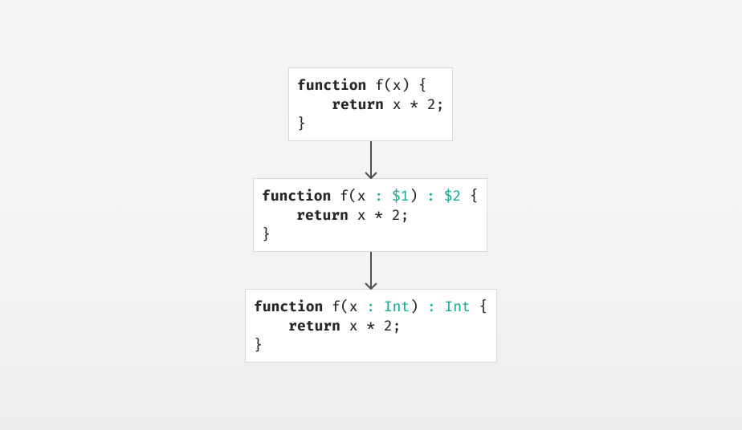

# Type Inference by Example, Part 1

  
*Type inference, in a nutshell.*

If you’re implementing a programming language, you might be pondering how to do type inference. Instead of going through the theory, we’ll go through some examples to build an intuition for how it works, and finally see how to put that into code.

Consider the following function:

```js
function f(x) {
    return x * 2;
} 
```

Since there’s no type annotation for `x`, and no explicit return type, we'll have to infer those.

For this, we can generate two fresh type variables `$1` and `$2`, and add those to our syntax tree:

```js
function f(x : $1) : $2 {
    return x * 2;
} 
```

> What are type variables? They are integers that act as placeholders for types that we don’t yet know. During type inference, they will be replaced with other types and thus disappear from the syntax tree.

For the expression `x * 2`, we know the type of `* : (Int, Int) => Int`, so we check `x` and `2` both with the expected type `Int`. We know that `x : $1` and `2 : Int`, so we get the type constraints:

```
$1 == Int
Int == Int
```

> What are type constraints? They are a way to record things we discover about types and their relations to each other, as we go through the type inference. An equality constraint may literally be represented in code as a pair of types.

For the statement `return x * 2;` we know from the type of `*` that `x * 2` returns an `Int`, and from `return` that this must be the return type, so we get the constraint:

```
$2 == Int
```

Now that we have a set of constraints, we need to solve them. Perhaps you can solve a system of equality constraints with pen and paper, but the algorithm to do it is called unification. We will cover the implementation of that later, but the output is a substitution — in this case the following:

```
$1 := Int
$2 := Int
```

> What is a substitution? It’s a map from type variables to types.

Applying the substitution to our syntax tree — replacing each type variable on the left hand side with the type on the right hand side — we get:

```js
function f(x : Int) : Int {
    return x * 2;
}
```

And we’re done.

Stay tuned for [part 2](../part2/article.md), where we’ll go through a more advanced example.
