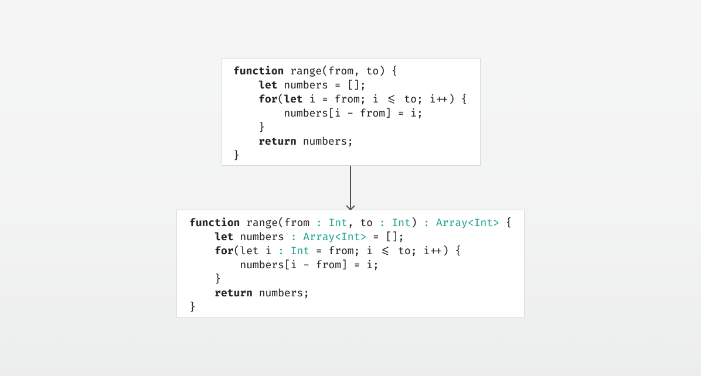

# Type Inference by Example, Part 2


*Type inference for the empty array.*

Continuing where we left off in [part 1](../part1/article.md), let’s look at a more advanced example that uses local variables and type constructors:

```js
function range(from, to) {
    let numbers = [];
    for(let i = from; i <= to; i++) {
        numbers[i - from] = i;
    }
    return numbers;
}
```

As in the previous installment, we add in fresh type variables:

```js
function range(from : $1, to : $2) : $3 {
    let numbers : $4 = [];
    for(let i : $5 = from; i <= to; i++) {
        numbers[i - from] = i;
    }
    return numbers;
}
```

Now, on the very first line, we encounter the empty array:

```js
let numbers : $4 = [];
```

We know that it should be an Array<… something …>, but what is something? Why, a fresh type variable of course! So for this line, we get the following constraint:

```
$4 == Array<$6>
```

The next line starts the for loop:

```js
for(let i : $5 = from; i <= to; i++) {
```

Wow, three statements in one line! Assuming that `++ : Int => Int`, this gives us three constraints:

```
$5 == $1
$5 == $2
$5 == Int
```

The for loop body assigns a value to an index in `numbers`:

```js
numbers[i - from] = i;
```

This tells us two things: `numbers` must be an array, and its element type must be the same as the type of `i`.

```
$4 == Array<$5>
```

From the same line, assuming `— : (Int, Int) => Int` we also constrain the types of `i` and from to be integers:

```
$5 == Int
$1 == Int
```

And finally, from the return statement, we constrain the return type to be the same as the type of `number`:

```
$3 == $4
```

Now that we have generated all the constraints, let’s consider them all together:

```
$4 == Array<$6>
$5 == $1
$5 == $2
$5 == Int
$4 == Array<$5>
$5 == Int
$1 == Int
$3 == $4
```

Again, unification finds a substitution that solve the above system of equations, but let’s first consider the two constraints involving Array. 
Because `$4` is on the other side of both equations, we can simplify that to `Array<$6> == Array<$5>`. 
Since both use a type constructor named `Array`, we check the generic arguments against each other by generating the constraint `$6 == $5`. And we already have another constraint that `$5 == Int`. The resulting substitution is thus:

```
$1 := Int
$2 := Int
$3 := Array<Int>
$4 := Array<Int>
$5 := Int
$6 := Int
```

Applying that to our syntax tree, we get:

```js
function range(from : Int, to : Int) : Array<Int> {
    let numbers : Array<Int> = [];
    for(let i : Int = from; i <= to; i++) {
        numbers[i - from] = i;
    }
    return numbers;
}
```

And we’re done.

Stay tuned for [part 3](../part3/article.md), where we’re going to look generic function calls.
