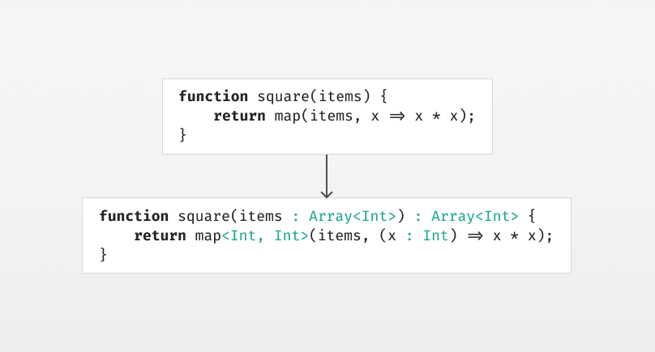

# Type Inference by Example, Part 3

  
*Inferring types for generic calls.*

Continuing where we left off in [part 2](../part2/article.md), we’ll now consider calling a generic function:

```js
function map<A, B>(array : Array<A>, body : A => B) : Array<B>
```

So this is the classic `map` function that applies a lambda function body to each element of the array and returns a new array with the results. Note that `map` takes two type parameters, `A` and `B`.

Here’s a function that squares each element of an array:

```js
function square(items) {
    return map(items, x => x * x);
}
```

Now, to add in the missing type annotations, we first must *instantiate* the type for `map` — that is, create a new copy of the function signature where every type parameter is replaced with a fresh type variable:

```js
function map<$3, $4>(array : Array<$3>, body : $3 => $4) : Array<$4>
```

While adding the missing type annotations, we make the generics explicit at the call site of `map`:

```js
function square(items : $1) : $2 {
    return map<$3, $4>(items, (x : $5) => x * x);
}
```

The first parameter of our instantiated `map` has type `Array<$3>`, so we get the following constraint:

```
$1 == Array<$3>
```

Considering the lambda function, and assuming that `* : (Int, Int) => Int`, we get the duplicate constraint:

```
$5 == Int
$5 == Int
```

And from the return type of `*` we know that the return type of the lambda must be `Int`, such that the full type of the lambda becomes `$5 => Int`. It should be the same type as the second parameter to `map`, so we get the constraint:

```
($5 => Int) == ($3 => $4)
```

From the return statement, we know that the return type of square is the same as the return type of `map`:

```
$2 == Array<$4>
```

Now we have all the constraints:

```
$1 == Array<$3>
$5 == Int
$5 == Int
($5 => Int) == ($3 => $4)
$2 == Array<$4>
```

Since `($5 => Int) == ($3 => $4)` has the same type constructor `=>` on both sides, we can replace it by two simpler constraints `$5 == $3` and `Int == $4`:

```
$1 == Array<$3>
$5 == Int
$5 == Int
$5 == $3
Int == $4
$2 == Array<$4>
```

Unification does this simplification internally — we’ll get to the algorithm in a bit — and yields us the following substitution:

```
$1 := Array<Int>
$2 := Array<Int>
$3 := Int
$4 := Int
$5 := Int
```

Applying the substitution to our syntax tree, we get:

```js
function square(items : Array<Int>) : Array<Int> {
    return map<Int, Int>(items, (x : Int) => x * x);
}
```

And we’re done.

It’s about time we look at how this is implemented under the hood. 
Stay tuned for [part 4](../part4/article.md), where we’ll look at the unification algorithm.
