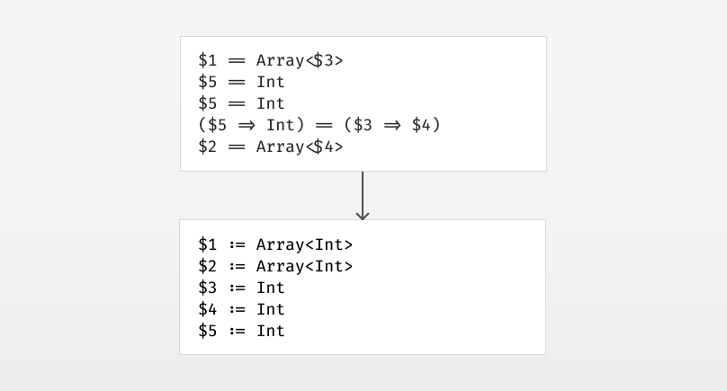

# Type Inference by Example, Part 4

  
*Using unification to turn each equality constraint into a substitution.*

Continuing where we left off in [part 3](../part3/article.md), let’s take a look at unification.

The first thing we’ll need is a representation for types. Let’s look at the types we’ve seen so far:

* `Int` — a plain type
* `Array<Int>` — a generic type
* `(Int, Int) => Int` — a function type
* `$1` — a type variable

The `Array` thing up there is called a type constructor — not to be confused with constructors in object oriented programming. A type constructor is something that takes type parameters — `Array` is a type constructor, and when given a type parameter, it becomes a type: `Array<Int>`.

The function type `=>` is also a type constructor. When given its type parameters, it becomes a type: `(Int, Int) => Int`. To make this more clear, we’ll name function types `FunctionN` internally, where `N` is the number of arguments it takes, e.g. `Function2<Int, Int, Int>`. The last `Int` here is the return type of the function.

And if we squint a bit, we can say that Int is a nullary type constructor. Given no type parameters at all, it becomes a type: `Int`. Thus we arrive at the following representation:

```scala
sealed abstract class Type

case class TConstructor(
  name : String, 
  generics : List[Type] = List()
) extends Type

case class TVariable(
  index : Int
) extends Type
```

This is Scala code. The sealed modifier says that there are no subclasses apart from those listed here. A case class can be used as a dumb carrier for data, where each field is public and immutable by default. Let’s see how our types look in this internal representation:

* `Int` — `TConstructor("Int")`
* `Array<Int>` — `TConstructor("Array", List(TConstructor("Int")))`
* `(Int, Int) => Int` — `TConstructor("Function2", List(TConstructor("Int"), TConstructor("Int"), TConstructor("Int")))`
* `$1` — `TVariable(1)`


## Back to unification.

> What is unification? Unification is an algorithm that takes two types and finds a substitution that makes them equal, if such a substitution exists.

While inferring types, the substitution will grow as we unify types. Recalling that a substitution maps type variables to types, and type variables are identified by integers, we’ll use an expanding array for this:

```scala
val substitution = ArrayBuffer[Type]()
```

We’ll choose a substitution where each type variable is initially substituted with itself, i.e. `substitution(x) == TypeVariable(x)`.

The unification itself is simple:

> Given two TConstructors, check that their name is equal and that they have the same number of type parameters. Then do a pointwise unification of the type arguments.
> Given a TVariable and another type, check if the type variable has been bound to something else than itself in the substitution. If so, unify whatever it’s bound to with the other type. 
> Otherwise, update the unification by binding the type variable to the other type.

When binding a type variable, we must perform an occurs check to avoid constructing an infinite type such as `$1 := Array<$1>`.


## The unification algorithm in code.

The unify function takes in two types and pattern matches on them.

```scala
def unify(t1 : Type, t2 : Type) : Unit = (t1, t2) match {
```

If we have two `TConstructors`, we check that their name is equal and that they have the same number of type parameters. Then we do a pointwise unification of the type arguments.

```scala
case (TConstructor(name1,generics1),TConstructor(name2,generics2))=>
  assert(name1 == name2)
  assert(generics1.size == generics2.size)
  for((t1, t2) <- generics1.zip(generics2)) unify(t1, t2)
```

If both sides are the same type variable, do nothing.

```scala
case (TVariable(i), TVariable(j)) if i == j => // do nothing
```

If one of the types is a type variable that’s bound in the substitution, use unify with that type instead.

```scala
case (TVariable(i), _) if substitution(i) != TVariable(i) =>
  unify(substitution(i), t2)
case (_, TVariable(i)) if substitution(i) != TVariable(i) =>
  unify(t1, substitution(i))
```

Otherwise, if one of the types is an unbound type variable, bind it to the other type. Remember to do an occurs check to avoid constructing infinite types.

```scala
case (TVariable(i), _) =>
  assert(!occursIn(i, t2))
  substitution(i) = t2
case (_, TVariable(i)) =>
  assert(!occursIn(i, t1))
  substitution(i) = t1
```

The assertions should be replaced with proper error reporting, but that is a topic for another day.

```scala
} // That's it for unification
```

We’ll need the `occursIn` method as well, which simply recurses into the type and checks if the type variable index in question occurs:

```scala
def occursIn(index : Int, t : Type) : Boolean = t match {
  case TVariable(i) if substitution(i) != TVariable(i) => 
    occursIn(index, substitution(i))
  case TVariable(i) => 
    i == index
  case TConstructor(_, generics) => 
    generics.exists(t => occursIn(index, t))
}
```

And we’re done.

Stay tuned for [part 5](../part5/article.md), where we’ll finish up the first version of the type inference.
