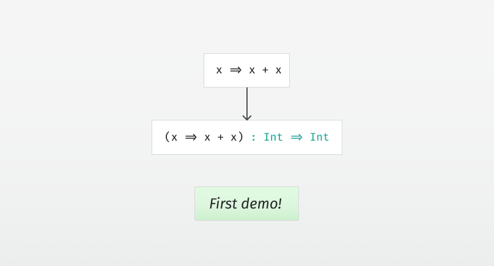

# Type Inference by Example, Part 5

  
*First demo—type inference for lambda calculus.*

Continuing where we left off in [part 4](../part4/article.md), let’s finish implementing a first version of the type inference — and see a small demo.

The first thing we’ll need is a language to infer types for. Let’s start with the lambda calculus:

```scala
sealed abstract class Expression
case class ELambda(x : String, e : Expression) extends Expression
case class EApply(e1 : Expression, e2 : Expression) extends Expression
case class EVariable(x : String) extends Expression
```

We’ll also need a representation of constraints. For now, we only have equality constraints:

```scala
sealed abstract class Constraint
case class CEquality(t1 : Type, t2 : Type) extends Constraint
```

As we go though the syntax tree and generate constraints, we’ll need somewhere to store them:

```scala
val typeConstraints = ArrayBuffer[Constraint]()
```

For generating fresh type variables, recall that we chose a representation where each type variable is initially bound to itself in the substitution:

```scala
def freshTypeVariable() : TVariable = {
    val result = TVariable(substitution.length)
    substitution += result
    result
}
```


## Inferring types of expressions

Now we need to go through the expression and generate the constraints that are to be solved, and find out what the type of the expression is:

```scala
def inferType(
    expression : Expression,
    environment : Map[String, Type]
) : Type = expression match {
```

This function takes in an expression and an environment and returns a type. The environment is used to keep track of the type of variables during inference.

For lambda functions, we generate a fresh type variable `t1` for the variable and add it to the environment. Then we infer the type `t2` of the lambda body in this environment. The final type is the function type `t1 => t2`:

```scala
case ELambda(x, e) =>
    val t1 = freshTypeVariable()
    val environment2 = environment.updated(x, t1)
    val t2 = inferType(e, environment2)
    TConstructor("Function1", List(t1, t2))
```

When we encounter a variable, we look it up in the environment and return that type:

```scala
case EVariable(x) =>
    environment(x)
```

For application (as in, calling a function with an argument) we first infer the type of the function and the argument, and generate a fresh type variable for the return type. Then we constrain the function type to be, well, a function type from the type of the argument to the return type:

```scala
case EApply(e1, e2) =>
    val t1 = inferType(e1, environment)
    val t2 = inferType(e2, environment)
    val t3 = freshTypeVariable()
    typeConstraints += 
        CEquality(t1, TConstructor("Function1", List(t2, t3)))
    t3
```

That’s it for the `inferType` function:

```scala
}
```


## Finishing up

The type we get back from `inferType` is likely a type variable at this point. In order to find out the concrete type, we’ll need to solve the constraints and then apply the substitution to the type.

Since we only have equality constraints right now, we can simply use unification we developed in part 4 to solve them:

```scala
def solveConstraints() : Unit = {
    for(CEquality(t1, t2) <- typeConstraints) unify(t1, t2)
    typeConstraints.clear()
}
```

Applying the substitution is done by following the chain of subsitutions and substituting the generics recursively:

```scala
def substitute(t : Type) : Type = t match {
    case TVariable(i) if substitution(i) != TVariable(i) => 
        substitute(substitution(i))
    case TConstructor(name, generics) => 
        TConstructor(name, generics.map(t => substitute(t)))
    case _ => t
}
```

And we’re done.


## Demo

Now that we have the first version of our type inference, it’s time to see it in action. [View and run the code so far here](Inference.scala).

Stay tuned for [part 6](../part6/article.md), where we’ll extend the type inference to a bigger language and insert the missing types into the syntax tree.
