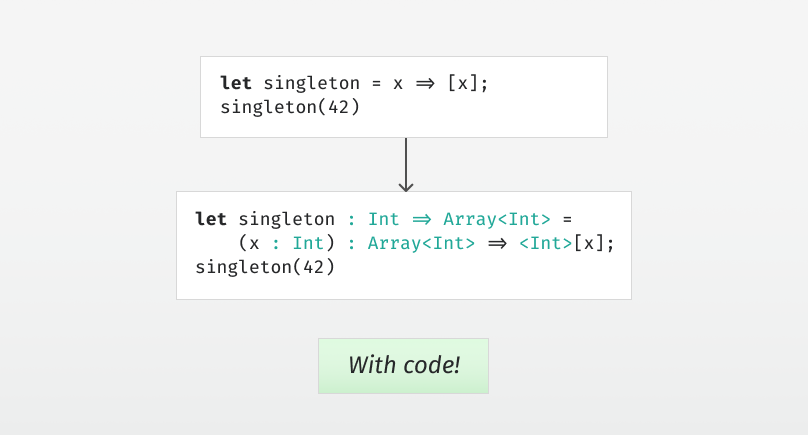

# Type Inference by Example, Part 6

  
*Wow, I’m glad we didn’t have to type all that!*

Continuing where we left off in [part 5](../part5/article.md), let’s extend the language and reconstruct the missing type annotations in the syntax tree.

First, we’ll extend the lambda function syntax and application so that it supports multiple arguments.

```scala
case class ELambda(
  parameters : List[Parameter],
  returnType : Option[Type],
  body : Expression
) extends Expression

case class EApply(
  function : Expression,
  arguments : List[Expression]
) extends Expression
```

Apart from multiple arguments, we’ve also added optional type annotations. The Parameter contains a name and an optional type.

```scala
case class Parameter(
  name : String,
  typeAnnotation : Option[Type]
)
```

We’ll introduce `let` for local variables:

```scala
case class ELet(
  name : String,
  typeAnnotation : Option[Type],
  value : Expression,
  body : Expression
) extends Expression

case class EVariable(
  name : String
) extends Expression
```

And literals for `Int`s, `String`s and `Array`s:

```scala
case class EInt(
  value : Int
) extends Expression

case class EString(
  value : String
) extends Expression

case class EArray(
  itemType : Option[Type],
  items : List[Expression],
) extends Expression
```


## Adding in the missing types

Now that we have type annotations in the syntax tree, we need the inference to be able to return a new syntax tree with all the type annotations filled in.

```scala
def infer(
  environment : Map[String, Type],
  expectedType : Type,
  expression : Expression
) : Expression = expression match {
```

Another change is that instead of returning the inferred type of the expression, we’ll take in the expected type instead. Note that we can still infer the type of the whole expression by using a fresh type variable as the expected type.

Let’s start with the lambda function. First, we’ll use fresh type variables in place of any missing type annotations. Then, we’ll infer the types in the lambda body expression in an environment containing the lambda parameters. Finally, we’ll constrain the expected type to be a function type of the appropriate arguments and return type. Finally, we return a lambda functions where all the missing type annotations have been filled in.

```scala
case ELambda(parameters, returnType, body) =>
  val newReturnType = returnType.getOrElse(freshTypeVariable())
  val newParameterTypes = 
    parameters.map(_.typeAnnotation.getOrElse(freshTypeVariable()))
  val newParameters = parameters.zip(newParameterTypes).map { 
    case (p, t) => p.copy(typeAnnotation = Some(t))
  }
  val newEnvironment = environment ++ newParameters.map { p =>
    p.name -> p.typeAnnotation.get
  }
  val newBody = infer(newEnvironment, newReturnType, body)
  typeConstraints += CEquality(expectedType,
    TConstructor(s"Function${parameters.size}", 
        newParameterTypes ++ List(newReturnType)
    )
  )
  ELambda(newParameters, Some(newReturnType), newBody)
```

For function application, we’ll generate fresh type variables for the arguments, and use these to construct a function type with those argument types and the expected type as the return type. We then infer the missing types in the function expression, expecting this function type. Finally, we infer the missing types of each argument, and return the new application where the missing type annotations have been filled in.

```scala
case EApply(function, arguments) =>
  val argumentTypes = arguments.map(_ => freshTypeVariable())
  val functionType = TConstructor(s"Function${arguments.size}", 
    argumentTypes ++ List(expectedType)
  )
  val newFunction = infer(environment, functionType, function)
  val newArguments = arguments.zip(argumentTypes).map { 
    case (argument, t) => infer(environment, t, argument)
  }
  EApply(newFunction, newArguments)
```

For variables, all we have to do is look up the type in the environment and constrain the expected type to be equal to that type.

```scala
case EVariable(name) =>
  val variableType = environment(name)
  typeConstraints += CEquality(expectedType, variableType)
  expression
```

For `let` bindings, we generate a fresh type variable if the type annotation is missing, and then infer the value expecting this type. We then check the body of the `let` in an environment extended with the let bound variable. Finally, we return a `let` binding where all the missing type annotations have been filled in.

```scala
case ELet(name, typeAnnotation, value, body) =>
  val newTypeAnnotation = 
    typeAnnotation.getOrElse(freshTypeVariable())
  val newValue = infer(environment, newTypeAnnotation, value)
  val newEnvironment = environment.updated(name, newTypeAnnotation)
  val newBody = infer(newEnvironment, expectedType, body)
  ELet(name, Some(newTypeAnnotation), newValue, newBody)
```

For `Int` and `String` literals, we just constrain the expected type.

```
case EInt(_) =>
  typeConstraints += CEquality(expectedType, TConstructor("Int"))
  expression

case EString(_) =>
  typeConstraints += CEquality(expectedType, TConstructor("String"))
  expression
```

For `Array` literals, we generate a fresh type variable if the type annotation is missing, and then infer each array item expecting this type. We then constrain the expected type to be an array of that item type. Finally, we return an array literal where all the missing type annotations have been filled in.

```scala
case EArray(itemType, items) =>
  val newItemType = itemType.getOrElse(freshTypeVariable())
  val newItems = items.map(item => 
    infer(environment, newItemType, item)
  )
  typeConstraints += CEquality(expectedType, 
    TConstructor("Array", List(newItemType))
  )
  EArray(Some(newItemType), newItems)
```

That’s it for the infer function:

```scala
}
```


## Substitution in expressions

After running the infer function, we have an expression with all the types filled in, but they’re still mostly type variables. We can solve the type constraints as in part 5 to get the right substitution, but we’ll still need a function to traverse the syntax tree and apply the substitution to all the types.

```scala
def substituteExpression(
  expression : Expression
) : Expression = expression match {

  case ELambda(parameters, returnType, body) =>
    val newReturnType = returnType.map(substitute)
    val newParameters = parameters.map(p => p.copy(
      typeAnnotation = p.typeAnnotation.map(substitute))
    )
    val newBody = substituteExpression(body)
    ELambda(newParameters, newReturnType, newBody)

  case EApply(function, arguments) =>
    val newFunction = substituteExpression(function)
    val newArguments = arguments.map(substituteExpression)
    EApply(newFunction, newArguments)

  case EVariable(_) =>
    expression

  case ELet(name, typeAnnotation, value, body) =>
    val newTypeAnnotation = typeAnnotation.map(substitute)
    val newValue = substituteExpression(value)
    val newBody = substituteExpression(body)
    ELet(name, newTypeAnnotation, newValue, newBody)

  case EInt(_) =>
    expression

  case EString(_) =>
    expression

  case EArray(itemType, items) =>
    val newItemType = itemType.map(substitute)
    val newItems = items.map(substituteExpression)
    EArray(newItemType, newItems)

}
```

And we’re done.


## Demo

Now that we have the a version of our type inference that can add in the missing type annotations, it’s time to see it in action. [View and run the code so far here](Inference.scala).

Stay tuned for [part 7](../part7/article.md), where we’ll add in mutually recursive functions with generics.
