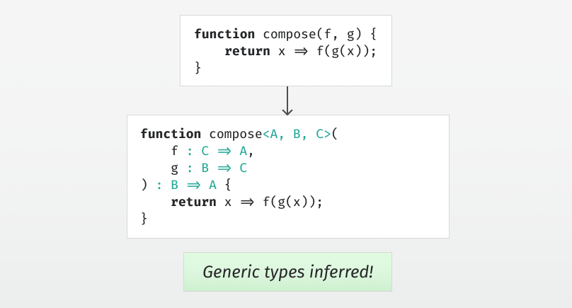

# Type Inference by Example, Part 7

  
*At the end of this article, we can infer generic types like these.*

Continuing where we left off in [part 6](../part6/article.md), let's add in mutually recursive functions with generics.

Consider the following example:

```
function even(x) { return x == 0 || odd(x - 1); }
function odd(x) { return x != 0 && even(x - 1); }
```

We say that these functions are mutually recursive: `even` calls `odd` and `odd` calls `even`. Because of that, we can't infer the types of each function in isolation - we must consider both at the same time. 
Let's add support for such mutually recursive functions to our syntax tree:

```scala
case class EFunctions(
  functions : List[GenericFunction],
  body : Expression
) extends Expression
```

The functions is a list of functions that may call each other, and they are in scope in body.

The next thing is that these functions may be generic - that is, they may have a type parameter list `<…>`, as in the classic `map` function:

```
function map<A, B>(array : Array<A>, f : A => B) : Array<B>
```

A generic function has a name and optionally a generic type. For the parameters and body, we'll use the lambda function defined earlier in the series:

```scala
case class GenericFunction(
    name : String,
    typeAnnotation : Option[GenericType],
    lambda : Expression
)
```

The `GenericType` is just a list of type parameters and an ordinary type:

```scala
case class GenericType(
    generics : List[String],
    uninstantiatedType : Type
)
```

It's called `uninstantiatedType` because it may mention some of the type parameters from generics, and we'll have to remember to instantiate that type, replacing the type parameters with fresh type variables on use.

Finally, when we use a variable, for example map, we need the ability to specify the type arguments, as in `map<Int, String>(...)`, so we add generics to our variables:

```scala
case class EVariable(
    name : String,
    generics : List[Type] = List()
) extends Expression
```


## Inferring the generic types

Earlier in the series, our environment looked like this: `Map[String, Type]`. We're going to change `Type` to `GenericType`, so that variables can be generic in our environment. Now our infer function looks like this:

```scala
def infer(
    environment : Map[String, GenericType],
    expectedType : Type,
    expression : Expression
) : Expression = expression match {
```

Whenever we encounter a variable, we'll look up the variable in the environment and get its generic type back. We then replace each type parameter by a fresh type variable to get an ordinary type. If the user has specified the type arguments explicitly, we constrain each of these fresh type variables to be equal to the corresponding user supplied type.

```scala
case EVariable(name, generics) =>
  val genericType = environment(name)
  val newGenerics = genericType.generics.map(_ => 
    freshTypeVariable()
  )
  val instantiation = genericType.generics.zip(newGenerics).toMap
  val variableType = instantiate(
    instantiation, 
    genericType.uninstantiatedType
  )
  if(generics.nonEmpty) {
    assert(generics.size == genericType.generics.size)
    for((t, v) <- generics.zip(newGenerics)) {
      typeConstraints += CEquality(t, v)
    }
  }
  typeConstraints += CEquality(expectedType, variableType)
  EVariable(name, newGenerics)
```


---

Now we get to the mutually recursive, possibly generic functions. This is where we find out which type parameters our functions should have.

The first thing we need to do is to create an environment `recursiveEnvironment` that's only for checking the mutually recursive functions. In this environment, the functions without a user supplied type annotation will get a fresh type variable instead. Then we use this environment to infer the type of each of the functions.

Now the functions - at least those without user supplied type annotations - have an ordinary type with type variables in them. We want to find out which of these type variables we can convert into type parameters to make the function generic. Before we do that, we solve all the outstanding type constraints to update our substitution, so we call `solveConstraints()`. 

After that, we call `generalize` on each of the functions that don't have a user supplied type annotation. This finds out which type variables are safe to turn into type parameters, and returns our `GenericType`s for the functions.

The only thing that's missing is to put these into an environment for inferring the body, where these functions are in scope.

```scala
case EFunctions(functions, body) =>

  val recursiveEnvironment = 
    environment ++ functions.map { function =>
      function.name -> function.typeAnnotation.getOrElse(
        GenericType(List(), freshTypeVariable())
      )
    }.toMap

  val ungeneralizedFunctions = functions.map { function =>
    val uninstantiatedType =
      recursiveEnvironment(function.name).uninstantiatedType
    function.copy(lambda = infer(
      recursiveEnvironment, 
      uninstantiatedType, 
      function.lambda
    ))
  }

  solveConstraints()

  val newFunctions = ungeneralizedFunctions.map { function =>
    if(function.typeAnnotation.nonEmpty) function else {
      val functionType = 
        recursiveEnvironment(function.name).uninstantiatedType
      val (newTypeAnnotation, newLambda) = generalize(
        environment, 
        functionType, 
        function.lambda
      )
      function.copy(
        typeAnnotation = Some(newTypeAnnotation), 
        lambda = newLambda
      )
    }
  }

  val newEnvironment = 
    environment ++ newFunctions.map { function =>
      function.name -> function.typeAnnotation.get
    }.toMap

  val newBody = infer(newEnvironment, expectedType, body)
  EFunctions(newFunctions, newBody)
```

That's it for the changes to the infer function.

```scala
} // the rest of this function remains the same
```


## Instantiation and generalization

We've done some of the work to instantiate a GenericType to a Type already, so all we need to do in the instantiate function is to replace all the occurrences of the type parameter with the corresponding type:

```scala
def instantiate(
  instantiation : Map[String, Type], 
  t : Type
) : Type = t match {
  case _ if instantiation.isEmpty => t
  case TVariable(i) if substitution(i) != TVariable(i) => 
    instantiate(instantiation, substitution(i))
  case TConstructor(name, generics) =>
    instantiation.get(name).map { instantiationType =>
      assert(generics.isEmpty)
      instantiationType
    }.getOrElse {
      TConstructor(name, generics.map(t =>
        instantiate(instantiation, t)
      ))
    }
  case _ => t
}
```

The generalize function has the task of finding out which type variables in a type are safe to turn into type parameters. 

So which ones are safe? Well, those type variables that won't be constrained later in the code. The only way for the later code to get one of the type variables in the type to further constrain is if it occurs in the environment. That means we simply need exclude the type variables that occur in the environment. 

In order to give these type parameters reasonable names, we consume from an iterator that produces names like `A`, `B`, `C`, etc.

We then replace those type variables with type parameters wherever they occur in the type and the expression. Along with that, we return a `GenericType` with the type parameters.

```scala
def generalize(
  environment : Map[String, GenericType],
  t : Type,
  expression : Expression
) : (GenericType, Expression) = {
  val genericTypeVariables = 
    freeInType(t) -- freeInEnvironment(environment)
  val genericNames = genericTypeVariables.map(i => 
    i -> genericParameterNames.next()
  ).toList
  val localSubstitution = substitution.clone()
  for((i, name) <- genericNames) {
    localSubstitution(i) = TConstructor(name)
  }
  val newExpression = 
    substituteExpression(localSubstitution, expression)
  val newType = substitute(localSubstitution, t)
  GenericType(
    genericNames.map { case (_, name) => name }, 
    newType
  ) -> newExpression
}
```

The `freeInType` function finds all the type variables that occur in a type. The `freeInGenericType` and `freeInEnvironment` does the same for generic types and the environment:

```scala
def freeInType(t : Type) : SortedSet[Int] = t match {
  case TVariable(i) if substitution(i) != TVariable(i) => 
    freeInType(substitution(i))
  case TVariable(i) => SortedSet(i)
  case TConstructor(_, generics) => 
    generics.map(freeInType).fold(SortedSet()) { _ ++ _ }
}
```

```scala
def freeInGenericType(t : GenericType) : SortedSet[Int] = {
  freeInType(t.uninstantiatedType)
}
```

```scala
def freeInEnvironment(
  environment : Map[String, GenericType]
) : SortedSet[Int] = {
  environment.values.map(freeInGenericType).
    fold(SortedSet[Int]()) { _ ++ _ }
}
```

And we're done.

## Demo

Now that we have the a version of our type inference that can infer generic types, it’s time to see it in action. [View and run the code so far here](Inference.scala).

Stay tuned for part 8, where we’ll take a look at overloading via type classes.
